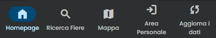

<!DOCTYPE html>
<html>
<body>
<h1>Sagre in Lombardia</h1>

Sito con cui è possibile effettuare ricerche delle sagre sul territorio lombardo. Sarà possibile filtrare in base al nome e alla posizione. Forniremo anche una mappa con tutte le sagre, in cui saranno presenti dei punti che rappresentano la posizione delle fiere. Cliccando su tali punti si vedranno informazioni di base sulla fiera, con la possibilità di essere indirizzati su una pagina con tutte le informazioni.
Previo login sarà possibile commentare e salvarsi nei preferiti alcune fiere.

<h2>Pagine:</h2>

<ul>
  <li>Homepage: pagina iniziale dove sarà presente una tabella con le prossime fiere (in ordine di data) e, se si hanno delle fiere nei preferiti, saranno presenti in cima alla tabella.</li>
  <li>Ricerca: pagina dove sarà possibile effettuare ricerche sulle fiere, sarà possibile filtrare per nome, data e posizione.</li>
  <li>Mappa: pagina che contiene la mappa con tutte le fiere presenti. Se si clicca un un punto si potranno andare a vedere le informazioni dettagliate su ogni evento.</li>
  <li>Area personale: pagina dove sarà possibile effettuare il login e registrarsi. A login effettuato questa pagina presenterà le proprie fiere preferite e i propri commenti.</li>
  <li>Aggiorna: pagina per aggiornare il database. Se il DB non viene aggiornato da una settimana verrete notificati sulla homepage.</li>
</ul>

Nella pagina contenente tutte le informazioni riguardati ad un evento sarà possibile, previo login, commentare o paggiungere ai preferiti quell'evento. 
</body>
</html>
