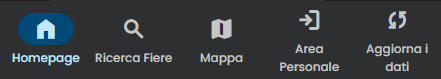

# Sagre in Lombardia 🎡

A comprehensive web application for searching, viewing, and managing traditional festivals (sagre) and fairs in the Lombardy region.

  

## 📖 Project Description

This website allows users to easily discover traditional events and fairs in the Lombardy region. Through a web interface and an interactive map, you can explore festivals, view detailed information, and filter results based on specific criteria (name, date, and location).

Event data is populated by fetching information from the **Open Data portal of the Lombardy Region**.

## ✨ Key Features

*   **Exploration and Advanced Search**: 
    *   **Homepage**: Provides a table of upcoming fairs sorted chronologically. Events saved in the user's favorites will be prioritized and displayed at the top of the list.
    *   **Search Area**: Internal search engine with combined filters for name, date, and geographical location.
*   **Interactive Map**: All available events can be browsed via a geographical map. Pins represent the exact locations of the fairs: a simple click provides initial information and access to full details.
*   **User Management and Personal Area**:
    *   Secure **registration and login** system (password hashing via `bcrypt`).
    *   Logged-in users can add fairs to their **Favorites** list and leave **Comments** on the event page.
*   **Event Details and PDF Download**: Each festival has its own descriptive page. It also supports downloading a handy summary PDF file containing the fair's information.
*   **Automatic Data Synchronization**: A dedicated script fetches and parses JSON data from the Lombardy Region APIs to update the database. A monitoring system displays a warning on the homepage if the database hasn't been updated in over a week.

## 🛠️ Tech Stack

The project is built using the following technologies:
*   **Backend**: Native PHP, with secure session management (Authentication, Controller).
*   **Database**: MySQL / MariaDB (managed via `mysqli`), with interconnected tables for users, festivals, locations (toponyms), and provinces.
*   **Frontend**: HTML5, CSS, JavaScript.
*   **Data Integration**: REST APIs from [Open Data Lombardia](https://www.dati.lombardia.it/).
